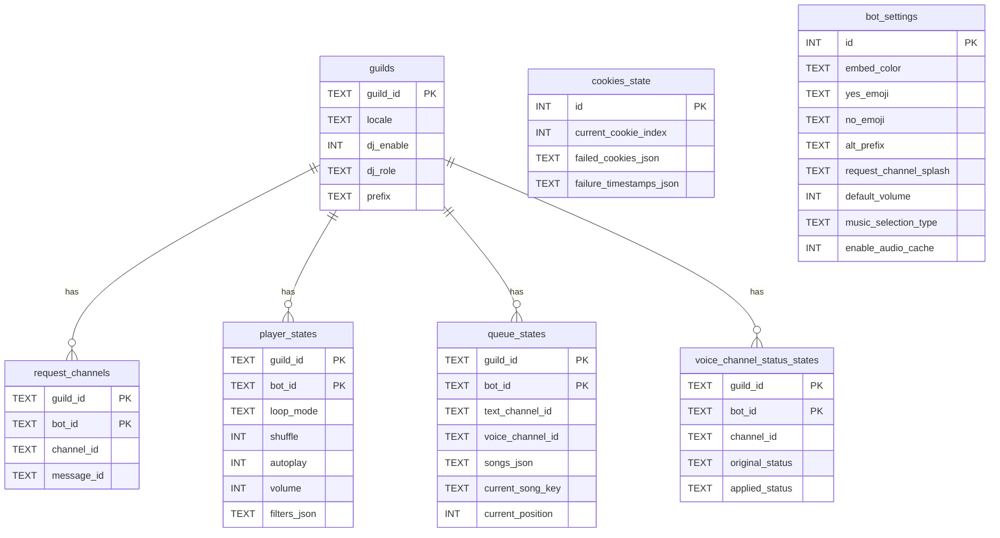

# Rawon Architecture Report

> **Repository:** [github.com/stegripe/rawon](https://github.com/stegripe/rawon)
> **Version:** 4.6.6 | **Stars:** 1.5k | **Language:** TypeScript (98.6%)
> **License:** CC BY-NC-ND 4.0
> **Report Date:** 2026-06-20

---

## Table of Contents

1. [Overview](#1-overview)
2. [Architecture Pattern](#2-architecture-pattern)
3. [Directory Structure](#3-directory-structure)
4. [Command Pattern](#4-command-pattern)
5. [Event Handling](#5-event-handling)
6. [Multi-Bot Architecture](#6-multi-bot-architecture)
7. [Database / Persistence](#7-database--persistence)
8. [Decorator-Based Guards](#8-decorator-based-guards)
9. [Graceful Shutdown](#9-graceful-shutdown)
10. [i18n](#10-i18n)
11. [nWoD Bot Applicability Assessment](#11-nwod-bot-applicability-assessment)

---

## 1. Overview

Rawon is a production-ready Discord music bot written in TypeScript. It supports YouTube, Spotify, SoundCloud, and direct file playback. Its standout feature is **multi-bot mode** — a single deployment can run N bot instances from comma-separated tokens, each handling voice channels independently while sharing a single SQLite database.

### Technology Stack

| Component | Technology | Version |
|-----------|-----------|---------|
| Runtime | Node.js | >= 20.0.0 |
| Discord API | discord.js | 14.26.4 |
| Bot Framework | @sapphire/framework | 5.5.0 |
| Decorators | @sapphire/decorators | 6.2.0 |
| Database | better-sqlite3 | 12.11.1 |
| Audio Processing | @discordjs/voice, ffmpeg-static, opusscript | — |
| Browser Automation | Puppeteer | 25.1.0 |
| Internationalization | i18n | 0.15.3 |
| Build Tool | @swc/cli + @swc/core | — |
| Linter | Biome | 2.5.0 |
| Package Manager | pnpm | — |

### Key Dependencies

- **discord.js v14** — Discord API wrapper with slash command and prefix support
- **Sapphire Framework** — Opinionated discord.js framework providing command stores, listener registration, precondition system, and `@ApplyOptions` decorator
- **better-sqlite3** — Synchronous SQLite bindings for Node.js (WAL mode enabled)
- **Puppeteer** — Headless Chrome for Google login/cookie management (bypasses YouTube bot detection on cloud hosts)
- **i18n** — Internationalization with 14 locales
- **youtubei** / **soundcloud.ts** — Music source resolvers

---

## 2. Architecture Pattern

Rawon uses a **hybrid OOP architecture** built on top of the Sapphire Framework. It is not a pure domain-driven design — it's a pragmatic, class-based system where decorator-driven configuration and a service locator pattern (`container`) reduce boilerplate.

### Core Architectural Principles

1. **Sapphire Framework as Foundation** — Commands, listeners, and preconditions are registered via Sapphire's store system. The `@ApplyOptions<CommandOptions>()` decorator configures each piece declaratively.

2. **Class-Based with Decorator-Driven Configuration** — Every command, listener, and precondition is a class. Configuration (name, description, cooldowns, etc.) is injected via decorators rather than constructor parameters.

3. **Container / Service Locator Pattern** — Sapphire's `container` object acts as a global registry. The `Rawon` client constructor populates it with shared services:
   ```typescript
   container.config = config;
   container.data = this.data;           // SQLiteDataManager
   container.spotify = this.spotify;     // SpotifyUtil
   container.utils = this.utils;         // ClientUtils
   container.requestChannelManager = this.requestChannelManager;
   container.license = this.license;
   container.audioCache = this.audioCache;
   container.cookies = this.cookies;
   container.request = this.request;     // got HTTP client
   ```

4. **Singleton MultiBotManager** — The `MultiBotManager` class implements the singleton pattern (`getInstance()`) to coordinate multiple bot instances. It routes voice channels to the correct bot using a priority algorithm.

5. **Manager Pattern for Domain Subsystems** — Each major feature is encapsulated in a manager class:
   - `SQLiteDataManager` — Database CRUD with OperationManager for serialized writes
   - `MultiBotManager` — Multi-bot voice channel routing
   - `MultiBotLauncher` — Bot instance lifecycle management
   - `RequestChannelManager` — Dedicated music request channel management
   - `AudioCacheManager` — Audio file caching
   - `CookiesManager` — Puppeteer-based cookie/session management
   - `RawonLicenseManager` — License validation
   - `SongManager` — Per-guild song queue (extends `Collection`)

### Architecture Diagram (Conceptual)

```
┌─────────────────────────────────────────────────────────────────┐
│                         Process Layer                            │
│  index.ts ─── MultiBotLauncher ─── ShardingManager ─── bot.ts   │
└──────────────┬─────────────────────────────┬────────────────────┘
               │                             │
       ┌───────▼────────┐           ┌────────▼────────┐
       │  Rawon Client   │           │  Rawon Client   │  (N instances)
       │  (Primary Bot)  │           │  (Secondary Bot) │
       └───────┬────────┘           └────────┬────────┘
               │                             │
       ┌───────▼─────────────────────────────▼────────┐
       │              Sapphire Framework                │
       │  ┌─────────┐ ┌──────────┐ ┌───────────────┐  │
       │  │Commands │ │Listeners │ │Preconditions  │  │
       │  │ (Store) │ │ (Store)  │ │   (Store)     │  │
       │  └─────────┘ └──────────┘ └───────────────┘  │
       └──────────────────┬───────────────────────────┘
                          │
       ┌──────────────────▼───────────────────────────┐
       │              Service Layer (container)         │
       │  SQLiteDataManager │ MultiBotManager           │
       │  SpotifyUtil       │ AudioCacheManager         │
       │  RequestChannelMgr │ CookiesManager            │
       │  RawonLicenseMgr   │ ClientUtils               │
       └──────────────────┬───────────────────────────┘
                          │
       ┌──────────────────▼───────────────────────────┐
       │              Data Layer                        │
       │  better-sqlite3 (WAL mode) │ File Cache       │
       │  7 tables, OperationManager serialization     │
       └──────────────────────────────────────────────┘
```

---

## 3. Directory Structure

```
rawon/
├── index.js                    # Entry point: FFmpeg check, yt-dlp download, imports dist/index.js
├── src/
│   ├── index.ts                # Process entry: multi-bot launcher, sharding, or direct start
│   ├── bot.ts                  # Single-bot entry: creates Rawon client, graceful shutdown, error handlers
│   │
│   ├── commands/
│   │   ├── developers/         # DevOnly commands (setup, eval, etc.)
│   │   ├── general/            # General commands (help, ping, locale, etc.)
│   │   └── music/              # 19 music commands
│   │       ├── PlayCommand.ts
│   │       ├── SkipCommand.ts
│   │       ├── QueueCommand.ts
│   │       ├── StopCommand.ts
│   │       ├── PauseCommand.ts
│   │       ├── ResumeCommand.ts
│   │       ├── VolumeCommand.ts
│   │       ├── ShuffleCommand.ts
│   │       ├── RepeatCommand.ts
│   │       ├── AutoPlayCommand.ts
│   │       ├── FilterCommand.ts
│   │       ├── SeekCommand.ts
│   │       ├── SkipToCommand.ts
│   │       ├── RemoveCommand.ts
│   │       ├── NowPlayingCommand.ts
│   │       ├── LyricsCommand.ts
│   │       ├── SearchCommand.ts
│   │       ├── DJCommand.ts
│   │       └── RequestChannelCommand.ts
│   │
│   ├── config/
│   │   ├── env.ts              # Environment variable parsing, token splitting, multi-bot detection
│   │   └── index.ts            # Client options, i18n config, exports all config
│   │
│   ├── listeners/              # 11 Sapphire Listener classes
│   │   ├── ChannelDeleteListener.ts
│   │   ├── ChannelUpdateListener.ts
│   │   ├── DebugListener.ts
│   │   ├── ErrorListener.ts
│   │   ├── GuildDeleteListener.ts
│   │   ├── InteractionCreateListener.ts
│   │   ├── ListenerErrorListener.ts
│   │   ├── MessageCreateListener.ts
│   │   ├── MessageDeleteListener.ts
│   │   ├── ReadyListener.ts
│   │   ├── VoiceStateUpdateListener.ts
│   │   └── WarnListener.ts
│   │
│   ├── preconditions/
│   │   └── DevOnly.ts          # DevOnly precondition (checks config.devs array)
│   │
│   ├── structures/
│   │   ├── Rawon.ts            # Main client class (extends SapphireClient)
│   │   ├── ServerQueue.ts      # Per-guild music queue (AudioPlayer, state management)
│   │   ├── CommandContext.ts    # Abstraction over prefix/slash command context
│   │   ├── BaseCommand.ts      # Base command class
│   │   └── BaseEvent.ts        # Base event class
│   │
│   ├── typings/
│   │   └── index.ts            # TypeScript type definitions
│   │
│   └── utils/
│       ├── decorators/
│       │   ├── Command.ts              # @Command class decorator
│       │   ├── Event.ts               # @Event class decorator
│       │   ├── MusicUtil.ts           # @inVC, @sameVC, @validVC, @haveQueue, @useRequestChannel
│       │   ├── CommonUtil.ts          # Common utility decorators
│       │   ├── createCmdExecuteDecorator.ts  # Factory for method decorators
│       │   └── createMethodDecorator.ts      # Low-level method decorator factory
│       │
│       ├── functions/          # Pure utility functions (createEmbed, i18n, parseTime, etc.)
│       │
│       ├── handlers/           # Music source resolvers
│       │   ├── GeneralUtil.ts  # play(), searchTrack(), checkQuery()
│       │   ├── SpotifyUtil.ts
│       │   └── YouTubeUtil.ts
│       │
│       └── structures/         # Manager/utility classes
│           ├── SQLiteDataManager.ts
│           ├── MultiBotManager.ts
│           ├── MultiBotLauncher.ts
│           ├── OperationManager.ts
│           ├── RequestChannelManager.ts
│           ├── AudioCacheManager.ts
│           ├── CookiesManager.ts
│           ├── RawonLicenseManager.ts
│           ├── ClientUtils.ts
│           ├── SongManager.ts
│           ├── NoStackError.ts
│           ├── DebugLogManager.ts
│           └── createLogger.ts
│
├── lang/                       # i18n locale files (14 locales)
├── docs/                       # Documentation (DISCLAIMERS, COOKIES_SETUP)
├── .env.example                # Environment template
├── dev.env.example             # Developer environment template
├── Dockerfile
├── docker-compose.yaml
├── package.json
├── tsconfig.json
├── biome.json                  # Linter config
└── .swcrc                      # SWC compiler config
```

---

## 4. Command Pattern

### Command Lifecycle

Commands extend Sapphire's `Command` class and are configured via `@ApplyOptions`. The framework auto-discovers commands from the compiled `dist/` directory based on file location (directory = category).

### Command Structure

```typescript
// Typical music command structure (simplified from PlayCommand.ts)
@ApplyOptions<CommandOptions>({
    name: "play",
    description: "Play a song",
    aliases: ["p"],
    options: ["force"],
    preconditions: ["GuildOnly"],
})
export class PlayCommand extends BaseCommand {
    public override async contextRun(ctx: CommandContext): Promise<void> {
        // Command implementation
    }
}
```

### Dual Prefix + Slash Support via CommandContext

Rawon supports both prefix commands and slash commands through the `CommandContext` abstraction. This class wraps either a `Message` or `CommandInteraction` behind a unified interface:

```typescript
// CommandContext provides a unified API
class CommandContext {
    public readonly message: Message;
    public readonly args: string[];
    // Provides: .guild, .channel, .member, .client, .reply(), .send(), etc.
}
```

The `CommandsCompatibility` class in `Rawon.ts` handles prefix command parsing and routing, while Sapphire natively handles slash commands.

### Method Decorators as Precondition Guards

Music commands use method decorators applied to `contextRun` that act as precondition guards. These are **not** Sapphire preconditions — they are custom TypeScript method decorators that intercept execution:

```typescript
@ApplyOptions<CommandOptions>({ ... })
export class SkipCommand extends BaseCommand {
    @inVC
    @sameVC
    @haveQueue
    public override async contextRun(ctx: CommandContext): Promise<void> {
        // Only runs if all guards pass
    }
}
```

### Directory-Based Categories

Commands are organized into subdirectories under `src/commands/`:

| Directory | Category | Visibility | Commands |
|-----------|----------|------------|----------|
| `developers/` | Developer | Hidden | setup, eval, etc. |
| `general/` | General | Visible | help, ping, locale, prefix, etc. |
| `music/` | Music | Visible | 19 commands (play, skip, queue, etc.) |

Sapphire's `fullCategory` property derives the category from the directory path. The `CommandsCompatibility.categories` getter groups commands by this property.

### Sapphire Auto-Discovery

Sapphire automatically registers commands, listeners, and preconditions by scanning the `baseUserDirectory` (set to the `src/` root directory in config). No manual registration is needed — placing a file in the correct directory is sufficient.

---

## 5. Event Handling

### Sapphire Listener Pattern

All event handlers are Sapphire `Listener` classes configured with `@ApplyOptions<ListenerOptions>()`:

```typescript
@ApplyOptions<ListenerOptions>({ event: "ready" })
export class ReadyListener extends Listener {
    public run(client: Client): void {
        // Handle ready event
    }
}
```

### Listener Inventory (11 Listeners)

| Listener | Event Source | Purpose |
|----------|-------------|---------|
| `ReadyListener` | Client | Bot startup, presence setup |
| `MessageCreateListener` | Client | Prefix command routing, request channel handling |
| `InteractionCreateListener` | Client | Slash command routing |
| `VoiceStateUpdateListener` | Client | Voice channel join/leave, auto-disconnect |
| `MessageDeleteListener` | Client | Cleanup request channel messages |
| `GuildDeleteListener` | Client | Cleanup guild data on bot removal |
| `ChannelDeleteListener` | Client | Cleanup request channels when channel deleted |
| `ChannelUpdateListener` | Client | Monitor channel permission changes |
| `ErrorListener` | Client | Error logging |
| `WarnListener` | Client | Warning logging |
| `DebugListener` | Client | Debug logging |
| `ListenerErrorListener` | Client | Listener error handling |

### Multi-Bot Event Forwarding

In multi-bot mode, only the primary bot (token index 0) is registered as `container.client`. Secondary bots cannot use Sapphire's automatic event registration for certain events (like `CoreReady` for application command registration). Instead, they manually forward events to the corresponding Sapphire listener:

```typescript
// In Rawon.build() — for non-primary bots in multi-bot mode
this.on("messageCreate", (message: Message) => {
    const listener = listenerStore.get("MessageCreateListener");
    if (listener?.run) {
        void (listener as { run: (m: Message) => Promise<void> }).run(message);
    }
});

this.on("interactionCreate", (interaction: Interaction) => {
    const listener = listenerStore.get("InteractionCreateListener");
    if (listener?.run) {
        void (listener as { run: (i: Interaction) => Promise<void> }).run(interaction);
    }
});

this.on("voiceStateUpdate", (oldState: VoiceState, newState: VoiceState) => {
    const listener = listenerStore.get("VoiceStateUpdateListener");
    if (listener?.run) {
        void (listener as { run: (o: VoiceState, n: VoiceState) => Promise<Message | undefined> }).run(oldState, newState);
    }
});

// ... similar for messageDelete, guildDelete, channelDelete, channelUpdate
```

This ensures all bot instances process events through the same listener logic, regardless of which bot instance receives the raw Discord event.

---

## 6. Multi-Bot Architecture

### Overview

Multi-bot mode is the defining architectural feature of Rawon. It allows a single deployment to run N Discord bot instances, each with its own token, that coordinate to handle voice channels across servers. This solves the problem of Discord's per-bot voice channel limitation — one bot can only be in one voice channel per server.

### Activation

Multi-bot mode activates automatically when the `DISCORD_TOKEN` environment variable contains comma-separated tokens:

```env
DISCORD_TOKEN="token1,token2,token3"
```

The `env.ts` config splits the token string and sets `isMultiBot = tokenArray.length > 1 && hasComma`.

### Components

#### MultiBotLauncher (`src/utils/structures/MultiBotLauncher.ts`)

Responsible for creating and managing N `Rawon` client instances:

```typescript
export class MultiBotLauncher {
    private readonly clients: Rawon[] = [];
    private readonly multiBotManager = MultiBotManager.getInstance();

    public async start(): Promise<void> {
        this.setupProcessHandlers();
        // Sequentially creates and registers each bot instance
        for (let i = 0; i < discordTokens.length; i++) {
            const client = await this.createBotInstance(discordTokens[i], i, clientOptions);
            this.clients.push(client);
        }
    }
}
```

Each bot instance:
1. Creates a new `Rawon` client with the same `clientOptions`
2. Calls `client.build(token)` which logs in and sets up event forwarding
3. Registers with `MultiBotManager` via `registerBot(client, tokenIndex, botId)`

#### MultiBotManager (`src/utils/structures/MultiBotManager.ts`)

Singleton that routes voice channels to the correct bot instance. Key data structures:

```typescript
export interface BotInstance {
    client: Rawon;
    tokenIndex: number;
    botId: Snowflake;
    isPrimary: boolean;  // tokenIndex === 0
}
```

### Bot Selection Algorithm

When a user issues a music command, `getBotForVoiceChannel()` determines which bot should handle it:

```
1. Check if any bot has an active queue for the requested voice channel
   → If yes, return that bot (continuity of playback)

2. Check if any bot is already in the requested voice channel
   → If yes, return that bot (reuse existing connection)

3. Find a free bot (not in any voice channel, no active queue)
   → Prefer the primary bot (tokenIndex === 0)
   → If primary is busy, use the next available secondary bot

4. If all bots are busy
   → Return null (request rejected)
```

Only bots with valid license (`client.license.usable`) are considered for music commands.

### Routing Decision Points

The `MultiBotManager` provides several routing methods:

| Method | Purpose |
|--------|---------|
| `getBotForVoiceChannel(guild, voiceChannelId)` | Select bot for music playback |
| `shouldRespond(client, guild)` | Should this bot handle general commands? |
| `shouldRespondToMusicCommand(client, guild, userVoiceChannelId)` | Should this bot handle music commands? |
| `shouldRespondToVoice(client, guild, voiceChannelId)` | Should this bot handle voice state changes? |
| `getResponsibleBot(guild)` | Which bot is responsible for general commands in this guild? |

### Shared State

All bots share the **same SQLite database file** (`cache/data.db`). This means:
- Guild settings (prefix, locale, DJ config) are shared
- Request channel configuration is per-bot (`bot_id` in the composite primary key)
- Queue states are per-bot, enabling independent playback in different voice channels
- Player states (loop, shuffle, volume, filters) are per-bot

### Primary Bot Responsibilities

The primary bot (token index 0) has special roles:
- Handles application command registration (`CoreReady` listener is disabled for secondary bots)
- Manages the Puppeteer browser for cookie operations
- Is preferred when multiple free bots are available
- Non-primary bots inherit player state from the primary bot if no own state exists

---

## 7. Database / Persistence

### SQLite via better-sqlite3

Rawon uses `better-sqlite3` for all persistent storage. The database file is located at `cache/data.db` and uses **WAL (Write-Ahead Logging) mode** for concurrent read performance.

### Schema (7 Tables)

```sql
-- Core guild settings
CREATE TABLE guilds (
    guild_id TEXT PRIMARY KEY,
    locale TEXT,
    dj_enable INTEGER DEFAULT 0,
    dj_role TEXT,
    prefix TEXT DEFAULT ''
);

-- Per-bot request channel configuration
CREATE TABLE request_channels (
    guild_id TEXT NOT NULL,
    bot_id TEXT NOT NULL,
    channel_id TEXT,
    message_id TEXT,
    PRIMARY KEY (guild_id, bot_id),
    FOREIGN KEY (guild_id) REFERENCES guilds(guild_id) ON DELETE CASCADE
);

-- Per-bot player state (loop, shuffle, volume, filters)
CREATE TABLE player_states (
    guild_id TEXT NOT NULL,
    bot_id TEXT NOT NULL,
    loop_mode TEXT DEFAULT 'OFF',
    shuffle INTEGER DEFAULT 0,
    autoplay INTEGER DEFAULT 0,
    volume INTEGER DEFAULT 100,
    filters_json TEXT DEFAULT '{}',
    PRIMARY KEY (guild_id, bot_id),
    FOREIGN KEY (guild_id) REFERENCES guilds(guild_id) ON DELETE CASCADE
);

-- Per-bot queue state (songs, current position) for crash recovery
CREATE TABLE queue_states (
    guild_id TEXT NOT NULL,
    bot_id TEXT NOT NULL,
    text_channel_id TEXT NOT NULL,
    voice_channel_id TEXT NOT NULL,
    songs_json TEXT NOT NULL,
    current_song_key TEXT,
    current_position INTEGER DEFAULT 0,
    PRIMARY KEY (guild_id, bot_id),
    FOREIGN KEY (guild_id) REFERENCES guilds(guild_id) ON DELETE CASCADE
);

-- Voice channel status (now-playing text)
CREATE TABLE voice_channel_status_states (
    guild_id TEXT NOT NULL,
    bot_id TEXT NOT NULL,
    channel_id TEXT NOT NULL,
    original_status TEXT,
    applied_status TEXT NOT NULL,
    PRIMARY KEY (guild_id, bot_id),
    FOREIGN KEY (guild_id) REFERENCES guilds(guild_id) ON DELETE CASCADE
);

-- Puppeteer cookie state (singleton row)
CREATE TABLE cookies_state (
    id INTEGER PRIMARY KEY CHECK (id = 1),
    current_cookie_index INTEGER DEFAULT 1,
    failed_cookies_json TEXT DEFAULT '[]',
    failure_timestamps_json TEXT DEFAULT '{}'
);

-- Global bot settings (singleton row)
CREATE TABLE bot_settings (
    id INTEGER PRIMARY KEY CHECK (id = 1),
    embed_color TEXT,
    yes_emoji TEXT,
    no_emoji TEXT,
    alt_prefix TEXT,
    request_channel_splash TEXT,
    default_volume INTEGER,
    music_selection_type TEXT,
    enable_audio_cache INTEGER
);
```

### OperationManager — Serialized Writes

The `SQLiteDataManager` wraps all write operations through an `OperationManager` that serializes async writes:

```typescript
public async saveQueueState(guildId: string, botId: string, queueState: ...): Promise<void> {
    await this.manager.add(async () => {
        // All writes go through this serialized queue
        const stmt = this.db.prepare(`INSERT INTO queue_states ...`);
        stmt.run(guildId, botId, ...);
    });
}
```

This prevents SQLite write contention when multiple bot instances or guilds write simultaneously.

### Queue State Persistence — Crash Recovery

The `ServerQueue` class saves queue state to the database:
- On song start (every track change)
- Every 5 seconds during playback (`_positionSaveInterval`)
- On graceful shutdown (SIGINT/SIGTERM)
- On uncaught exception (best-effort before exit)

On startup, `ServerQueue.loadSavedState()` restores:
- Player settings (loop mode, shuffle, volume, filters)
- Queue contents (songs, current position)
- Voice channel and text channel references

This enables **crash recovery** — if the bot restarts, it can resume playback from where it left off.

### Schema Migrations

Rawon uses runtime `ALTER TABLE` checks rather than a migration framework:

```typescript
// In SQLiteDataManager.initSchema()
const tableInfo = this.db.prepare("PRAGMA table_info(guilds)").all();
const hasPrefixColumn = tableInfo.some((col) => col.name === "prefix");
if (!hasPrefixColumn) {
    this.db.exec(`ALTER TABLE guilds ADD COLUMN prefix TEXT DEFAULT '';`);
}
```

This is simple but effective for a single-developer project with infrequent schema changes.

---

## 8. Decorator-Based Guards

This is one of Rawon's most distinctive patterns. Music commands use **TypeScript method decorators** as precondition guards that run before the command logic.

### Implementation

Guards are created using `createCmdExecuteDecorator()`, which wraps a validation function into a method decorator:

```typescript
// src/utils/decorators/createCmdExecuteDecorator.ts
export function createCmdExecuteDecorator(
    validator: (ctx: CommandContext) => boolean | Promise<boolean>
): MethodDecorator {
    return (target, propertyKey, descriptor) => {
        const original = descriptor.value;
        descriptor.value = async function (ctx: CommandContext, ...args: unknown[]) {
            const result = await validator(ctx);
            if (!result) return; // Guard blocked execution
            return original.call(this, ctx, ...args);
        };
    };
}
```

### Available Guards

| Decorator | Purpose | Behavior |
|-----------|---------|----------|
| `@inVC` | User must be in a voice channel | Replies with warning if not in VC |
| `@validVC` | Bot must have join + speak permissions | Checks `joinable` and `Speak` permission |
| `@sameVC` | User and bot must be in same channel | **Multi-bot aware** — uses `MultiBotManager.shouldRespondToMusicCommand()` |
| `@haveQueue` | Guild must have an active queue | Replies with warning if no queue |
| `@useRequestChannel` | Command must be used in the request channel | Blocks if request channel is configured and user is not in it |

### Multi-Bot Aware Guard: @sameVC

The `@sameVC` guard is the most complex. It integrates with `MultiBotManager` to determine if *this specific bot instance* should handle the command:

```typescript
export const sameVC = createCmdExecuteDecorator((ctx) => {
    const client = ctx.client as Rawon;
    const member = ctx.member as GuildMember | null;

    if (client.config.isMultiBot) {
        const userVoiceChannelId = member?.voice.channel?.id ?? null;
        if (userVoiceChannelId) {
            const shouldRespond = client.multiBotManager.shouldRespondToMusicCommand(
                client, thisBotGuild, userVoiceChannelId
            );
            if (!shouldRespond) return false; // Another bot should handle this
        }
    }

    // Standard same-VC check
    const botVc = thisBotGuild.queue?.connection?.joinConfig.channelId
        ?? thisBotGuild.members.me.voice.channel.id;
    if (member?.voice.channel?.id !== botVc) {
        void ctx.reply({ embeds: [createEmbed("warn", __("utils.musicDecorator.sameVC"))] });
        return false;
    }
    return true;
});
```

### Usage Pattern

Decorators are stacked on the `contextRun` method:

```typescript
export class PauseCommand extends BaseCommand {
    @inVC        // 1. User must be in voice
    @sameVC      // 2. User and bot must be in same channel (multi-bot aware)
    @haveQueue   // 3. Active queue must exist
    public override async contextRun(ctx: CommandContext): Promise<void> {
        ctx.guild!.queue!.playing = false;
        void ctx.reply({ embeds: [createEmbed("info", "Paused.")] });
    }
}
```

Execution order follows decorator stacking: `@inVC` → `@sameVC` → `@haveQueue` → actual method. If any guard returns `false`, execution stops and the guard sends its own reply.

---

## 9. Graceful Shutdown

Rawon implements comprehensive graceful shutdown to prevent data loss, particularly for in-flight music queues.

### Signal Handlers

Both `SIGINT` and `SIGTERM` trigger `gracefulShutdown()`:

```typescript
// src/bot.ts (single-bot mode)
async function gracefulShutdown(signal: string): Promise<void> {
    container.logger.info(`Received ${signal}, shutting down gracefully...`);

    stopAutoUpdater();           // Stop yt-dlp auto-updater
    client.license.stop();       // Stop license polling

    await saveAllQueueStates();  // Save all guild queue states to SQLite

    await client.cookies.shutdown().catch(() => {});  // Close Puppeteer browser

    client.destroy();            // Disconnect from Discord
    process.exit(0);
}

process.on("SIGINT", () => void gracefulShutdown("SIGINT"));
process.on("SIGTERM", () => void gracefulShutdown("SIGTERM"));
```

### Uncaught Exception Handler

On `uncaughtException`, Rawon attempts to save queue states before exiting:

```typescript
process.on("uncaughtException", (err) => {
    container.logger.error(err, "UNCAUGHT_EXCEPTION");
    void saveAllQueueStates()
        .then(() => container.logger.info("[Crash] Queue states saved before exit"))
        .catch((saveErr) => container.logger.warn("[Crash] Failed to save queue states:", saveErr))
        .finally(() => process.exit(1));
});
```

### Per-Guild Timeout

Each guild's queue save has a 5-second timeout to prevent a single slow save from blocking the entire shutdown:

```typescript
const SAVE_QUEUE_TIMEOUT_MS = 5000;

async function saveAllQueueStates(): Promise<void> {
    const savePromises: Promise<void>[] = [];
    for (const [guildId, guild] of client.guilds.cache) {
        if (guild.queue) {
            const timeout = new Promise<void>((_, reject) =>
                setTimeout(() => reject(new Error(`Save timeout for guild ${guildId}`)), SAVE_QUEUE_TIMEOUT_MS)
            );
            savePromises.push(
                Promise.race([guild.queue.saveQueueState(), timeout]).catch((err) => {
                    container.logger.warn(`[Shutdown] Queue save timeout/skip for guild ${guildId}:`, err);
                })
            );
        }
    }
    await Promise.all(savePromises);
}
```

### Multi-Bot Shutdown

The `MultiBotLauncher` has its own shutdown handler that iterates all clients:

```typescript
private async gracefulShutdown(signal: string): Promise<void> {
    await this.saveAllQueueStates();     // Save queues for ALL bot instances
    await firstClient.cookies.shutdown(); // Close shared browser
    for (const client of this.clients) {
        client.license.stop();
        client.destroy();
    }
    process.exit(0);
}
```

---

## 10. i18n

### Configuration

Rawon uses the `i18n` npm package configured in `src/config/index.ts`:

```typescript
i18n.configure({
    defaultLocale: "en-US",
    directory: path.join(process.cwd(), "lang"),
    locales: [
        "en-US", "es-ES", "id-ID", "fr-FR",
        "zh-CN", "zh-TW", "uk-UA", "vi-VN",
        "pt-BR", "ru-RU", "ja-JP", "tr-TR",
        "ko-KR", "ms-MY"
    ],
    objectNotation: true,
    updateFiles: false,
    syncFiles: false,
});
```

### Per-Guild Locale

Each guild can have its own locale stored in the `guilds` table. The bot reads this at runtime to serve responses in the guild's preferred language:

```typescript
// Helper functions used throughout the codebase
const __ = i18n__(client, ctx.guild);       // Simple translation
const __mf = i18n__mf(client, ctx.guild);   // Translation with Mustache-style formatting
```

### Locale Files

Language files are JSON objects in the `lang/` directory. Each file contains nested keys matching the `objectNotation: true` pattern:

```
lang/
├── en-US.json
├── es-ES.json
├── fr-FR.json
├── ... (14 total)
```

---

## 11. nWoD Bot Applicability Assessment

This section evaluates which Rawon patterns are applicable to the nWoD (New World of Darkness) Discord bot — a dice-rolling and character-management bot with no voice features.

### Summary Matrix

| Rawon Pattern | Applicability | Effort | Impact |
|---------------|--------------|--------|--------|
| Graceful Shutdown | **Highly applicable** | Low | High |
| SQLite Persistence | **Applicable** | Medium | Medium |
| Decorator Guards | **Partially applicable** | Low | Medium |
| Multi-Bot Architecture | Not applicable | — | — |
| Sapphire Framework | Not applicable (nWoD uses discord.js directly) | — | — |
| Music Queue / ServerQueue | Not applicable | — | — |
| Puppeteer / Cookie Mgmt | Not applicable | — | — |
| i18n | **Applicable** | Medium | Low |

---

### Graceful Shutdown (Highly Applicable)

The nWoD bot currently has no graceful shutdown handling. Adopting Rawon's pattern would prevent data loss during deployments and crashes.

**Current nWoD pattern:** None.

**Rawon-style improvement for `src/Bot.ts`:**

```typescript
// Proposed: Add to nWoD bot's main entry point
function setupGracefulShutdown(client: Client) {
    const shutdown = async (signal: string) => {
        console.log(`Received ${signal}, shutting down gracefully...`);

        // Save any in-flight state (active paradox sessions, pending rolls, etc.)
        // Example: saveActiveSessions(client);

        client.destroy();
        process.exit(0);
    };

    process.on("SIGINT", () => shutdown("SIGINT"));
    process.on("SIGTERM", () => shutdown("SIGTERM"));

    process.on("uncaughtException", (err) => {
        console.error("Uncaught exception:", err);
        // Best-effort state save before crash exit
        // saveActiveSessions(client).catch(() => {});
        client.destroy();
        process.exit(1);
    });

    process.on("unhandledRejection", (reason) => {
        console.error("Unhandled rejection:", reason);
        // Log but don't exit — let the process continue
    });
}
```

**Why it matters:** Vercel, Railway, and other serverless/container platforms send `SIGTERM` before killing a process. Without a handler, in-flight dice rolls or paradox resolutions could be lost mid-response.

---

### SQLite Persistence for Guild Settings (Future Consideration)

Rawon's `SQLiteDataManager` pattern could store nWoD bot guild settings that currently don't persist across restarts.

**Potential nWoD use cases:**

| Setting | Description |
|---------|-------------|
| Default character | Per-guild default character for dice rolls |
| API roll preference | Whether to use the external dice API or local roller |
| Paradox behavior | Auto-roll paradox, prompt, or skip |
| Storyteller role | Role ID for storyteller permissions |
| Custom roll macros | Guild-defined roll shortcuts |

**Example — Adapted SQLiteDataManager for nWoD:**

```typescript
// Proposed: src/utils/GuildSettingsManager.ts
import Database from "better-sqlite3";

interface NwodGuildSettings {
    defaultCharacter?: string;
    useApiRolls: boolean;
    paradoxMode: "auto" | "prompt" | "skip";
    storytellerRoleId?: string;
    locale: string;
}

export class GuildSettingsManager {
    private readonly db: Database.Database;
    private cache = new Map<string, NwodGuildSettings>();

    constructor(dbPath: string) {
        this.db = new Database(dbPath);
        this.db.pragma("journal_mode = WAL");
        this.initSchema();
        this.loadAll();
    }

    private initSchema(): void {
        this.db.exec(`
            CREATE TABLE IF NOT EXISTS guild_settings (
                guild_id TEXT PRIMARY KEY,
                default_character TEXT,
                use_api_rolls INTEGER DEFAULT 0,
                paradox_mode TEXT DEFAULT 'prompt',
                storyteller_role_id TEXT,
                locale TEXT DEFAULT 'en-US'
            )
        `);
    }

    get(guildId: string): NwodGuildSettings {
        return this.cache.get(guildId) ?? {
            useApiRolls: false,
            paradoxMode: "prompt",
            locale: "en-US",
        };
    }

    async set(guildId: string, settings: Partial<NwodGuildSettings>): Promise<void> {
        const current = this.get(guildId);
        const merged = { ...current, ...settings };
        this.db.prepare(`
            INSERT INTO guild_settings (guild_id, default_character, use_api_rolls, paradox_mode, storyteller_role_id, locale)
            VALUES (?, ?, ?, ?, ?, ?)
            ON CONFLICT(guild_id) DO UPDATE SET
                default_character = excluded.default_character,
                use_api_rolls = excluded.use_api_rolls,
                paradox_mode = excluded.paradox_mode,
                storyteller_role_id = excluded.storyteller_role_id,
                locale = excluded.locale
        `).run(guildId, merged.defaultCharacter ?? null, merged.useApiRolls ? 1 : 0, merged.paradoxMode, merged.storytellerRoleId ?? null, merged.locale);
        this.cache.set(guildId, merged);
    }
}
```

**Key patterns borrowed from Rawon:**
- WAL mode for concurrent reads
- `ON CONFLICT ... DO UPDATE SET` (upsert) pattern
- In-memory cache backed by SQLite
- Singleton-style initialization in the client constructor

---

### Decorator Guards for Permission Checking (Partially Applicable)

The nWoD bot has no voice features, so `@inVC`, `@sameVC`, and `@validVC` are not directly applicable. However, the **decorator pattern itself** could improve command precondition handling.

**Current nWoD approach:** Likely inline permission checks in each command's `execute()` method.

**Rawon-style decorator guards for nWoD:**

```typescript
// Proposed: src/utils/decorators.ts
import { CommandInteraction, PermissionsBitField } from "discord.js";

function createGuard(
    check: (interaction: CommandInteraction) => boolean | Promise<boolean>,
    message: string
): MethodDecorator {
    return (_target, _propertyKey, descriptor) => {
        const original = descriptor.value as Function;
        descriptor.value = async function (interaction: CommandInteraction, ...args: unknown[]) {
            if (!(await check(interaction))) {
                await interaction.reply({ content: message, ephemeral: true });
                return;
            }
            return original.call(this, interaction, ...args);
        };
    };
}

// Storyteller-only commands
export const requireStoryteller = createGuard(
    (interaction) => {
        const settings = guildSettingsManager.get(interaction.guildId!);
        if (!settings.storytellerRoleId) return true; // No role configured = allow all
        return interaction.member?.roles?.cache?.has(settings.storytellerRoleId) ?? false;
    },
    "Only storytellers can use this command."
);

// DM-only commands (e.g., /paradox for private paradox rolls)
export const requireDMChannel = createGuard(
    (interaction) => interaction.channel?.isDMBased() ?? false,
    "This command can only be used in DMs."
);

// Guild-only commands
export const requireGuild = createGuard(
    (interaction) => interaction.guildId !== null,
    "This command can only be used in a server."
);

// Usage in a command:
export class ParadoxCommand {
    @requireDMChannel
    async execute(interaction: CommandInteraction) {
        // Private paradox resolution
    }
}
```

**Applicable nWoD scenarios:**
- `@requireStoryteller` — Restrict storyteller commands (e.g., `/set-character`, `/modify-trait`)
- `@requireDMChannel` — Private paradox rolls, sensitive character info
- `@requireGuild` — Commands that need guild context (shared character sheets)
- `@requireAPIAccess` — Commands that depend on external API availability

---

### i18n (Applicable but Low Priority)

Rawon's i18n setup with 14 locales and per-guild language storage could benefit the nWoD bot if it serves international playgroups. The `i18n` npm package is straightforward to adopt, and the per-guild locale pattern from `guild_settings` would store the preference.

**However:** The nWoD bot's audience is likely English-speaking RPG groups, making this a low-priority improvement.

---

### What NOT to Borrow

| Rawon Pattern | Why Not Applicable |
|---------------|-------------------|
| **Sapphire Framework** | nWoD uses discord.js directly; migrating to Sapphire would be a full rewrite with minimal benefit for a non-music bot |
| **Multi-Bot Architecture** | nWoD has no voice channel limitations to work around; a single bot instance suffices |
| **ServerQueue / Music Queue** | No music playback features |
| **Puppeteer / Cookie Management** | No YouTube streaming; no bot-detection bypass needed |
| **AudioCacheManager** | No audio caching requirements |
| **Music Source Resolvers** | No Spotify/YouTube/SoundCloud integration |

---

## Appendix A: Key Type Definitions

```typescript
// From src/typings/index.ts (inferred from usage)
interface GuildData {
    locale?: string;
    prefix?: string;
    dj?: { enable: boolean; role: string | null };
    requestChannel?: { channelId: string | null; messageId: string | null };
    playerState?: {
        loopMode: "OFF" | "SONG" | "QUEUE";
        shuffle: boolean;
        autoplay: boolean;
        volume: number;
        filters: Record<string, boolean>;
    };
    queueState?: {
        textChannelId: string;
        voiceChannelId: string;
        songs: SavedQueueSong[];
        currentSongKey: string | null;
        currentPosition: number;
    };
    voiceChannelStatusState?: {
        channelId: string;
        originalStatus: string | null;
        appliedStatus: string;
    };
}

interface BotSettings {
    embedColor: string;
    yesEmoji: string;
    noEmoji: string;
    altPrefix: string[];
    requestChannelSplash: string;
    defaultVolume: number;
    musicSelectionType: "message" | "selectmenu" | "buttons";
    enableAudioCache: boolean;
}
```

## Appendix B: Rawon Client Constructor Flow

```
index.js
  └─ FFmpeg check
  └─ yt-dlp download
  └─ import("./dist/index.js")
       │
       ▼
  src/index.ts
  └─ Parse DISCORD_TOKEN (split by comma)
  └─ if isMultiBot:
  │    └─ MultiBotLauncher.start()
  │         └─ for each token:
  │              └─ new Rawon(clientOptions)
  │              └─ client.build(token)
  │                   └─ cookies.initialize()
  │                   └─ client.login(token)
  │                   └─ MultiBotManager.registerBot()
  │                   └─ Setup event forwarding (if non-primary)
  └─ else if enableSharding:
  │    └─ ShardingManager.spawn()
  └─ else:
       └─ import("./bot.ts")
            └─ new Rawon(clientOptions)
            └─ client.build(token)
            └─ Setup SIGINT/SIGTERM handlers
            └─ Setup uncaughtException handler
```

## Appendix C: Database ERD



---

*Report generated from source analysis of [stegripe/rawon](https://github.com/stegripe/rawon) v4.6.6 (927 commits, main branch).*
